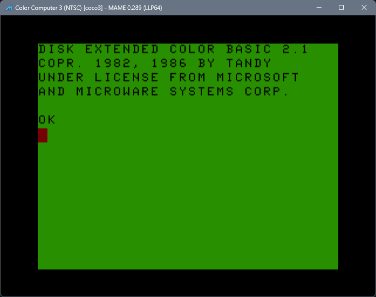
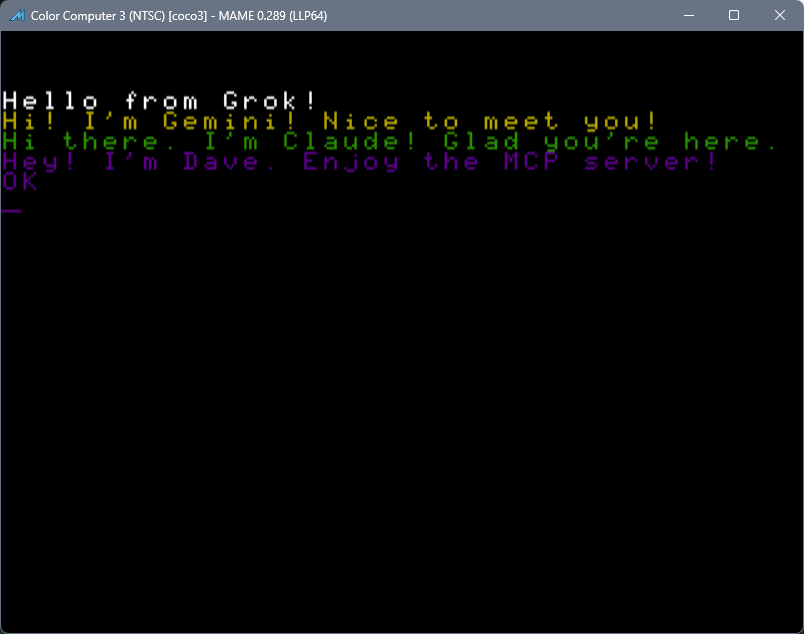
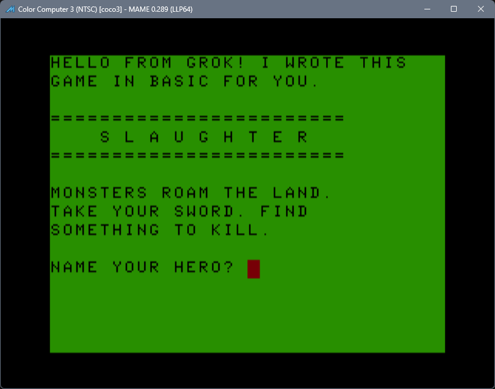
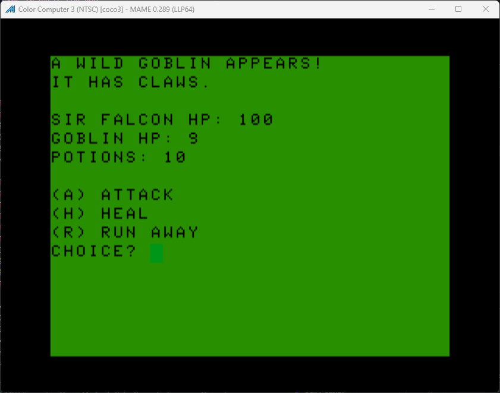

# CoCo 3 MCP Bridge

An MCP server that runs a Color Computer 3 in MAME. An AI assistant can type BASIC, mount disks, take screenshots, and read or write memory.

This copy is set up for Windows 10 or newer. Linux and macOS need the same pieces, with paths adjusted.

## What you need

- [Node.js](https://nodejs.org/) 20 or newer
- [MAME](https://www.mamedev.org/) and your own CoCo 3 ROMs (`coco3.zip`)
- [ToolShed](https://github.com/nitros9project/toolshed) `decb`, only if you use `coco_build_disk`

MAME, ROMs, and ToolShed are not included. Install those yourself.

ROMs and other CoCo software: [Color Computer Archive](https://colorcomputerarchive.com/).

## Setup

Put `mame.exe` and a `roms` folder in `mame/`, or point `.env` at a MAME install you already have. See [mame/README.md](mame/README.md).

For disk builds, put `decb.exe` in `toolshed/`. See [toolshed/README.md](toolshed/README.md).

From the `MCP` folder:

```bat
copy .env.example .env
```

Edit `.env` so `MAME_PATH`, `MAME_ROMPATH`, and `DECB_PATH` match your machine.

```bat
npm install
npm run build
```

The same `npm install`, `npm run build`, `npm start`, and `npm test` commands work from the repo root. They just run the `MCP` copies.

## Run

Point your MCP client at `MCP/dist/index.js`. Use the `coco_start` tool to launch MAME. Don't start MAME yourself first.

## Files

```text
MCP/storage/disks/       disk images (.dsk)
MCP/storage/host/bas/    BASIC source on the PC
MCP/storage/host/bin/    .BIN files
MCP/storage/host/data/   other files
```

Mount with a path like `storage/disks/game.dsk`. That path is resolved from the `MCP` folder. See [MCP/storage/README.md](MCP/storage/README.md).

## Screenshots









## Disclosure

Agentic AI was used in partial creation of this app.

## License

[MIT](LICENSE)
